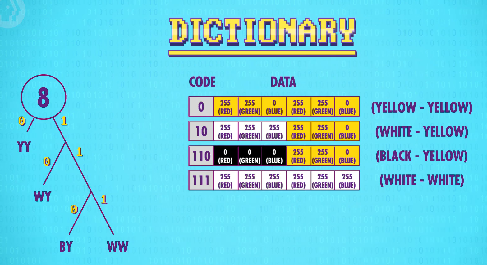

# 计算机科学速成课

计算机大脑——ALU，计算机中负责运算的组件

ALU（算术逻辑单元）有算术单元、逻辑单元组成，前者负责数字运算，后者负责逻辑运算。

半加器、全加器

8位 ripple carry adder

溢出 overflow

carry-look-ahead adder

## Memory

与门保存 0，或门保存 1。

组合起来，成为 AND-OR Latch

进一步抽象，形成 Gated Latch。

一组锁存器，构成寄存器。

寄存器矩阵能够提高运行效率。

## CPU

缓存

## Programming Basics - Statements & Functions

变量——对内存地址的抽象

将通用的功能，封装进函数。

模块化编程（Modularizing programs）

## Intro to Algorithms

算法：解决问题的步骤。

算法复杂度。

### Sorting

- 选择排序
- 归并排序（比选择排序更有效率）

### Graph Search

Dijkstra‘s algorithm

## Data Structures

结构体 Struct

链表

队列和栈

树

图

## Alan Turing

Lambda 算子数学表达系统

Turing Machine 证明了如果资源充足，可以通过它做任何事情。

Turing Complete

Turing 证明”停机（halting）问题“是一个悖论。所以，并不是所有问题都能通过计算解决。

可计算性理论，Church-Turing Thesis。

Turing test，它的现代版本是在网站登录时经常见到的”CAPTCHA（completely automated public turing test to tell computers and humans apart）“

图灵奖。

## Software Engineering

## Integrated Circuits & Moore's Law

Silicon wafer

现在的 CPU 中集成了数十亿晶体管。

摩尔定律已达极限。

## Operating Systems

操作系统将硬件抽象为 API——设备驱动程序。

批处理 -> 多任务处理

内存地址虚拟化，动态内存分配，内存保护

Terminal

分时操作系统 Time-Sharing

Unix：由内核和其他库组成。

kernel panic

## Memory & Storage

延迟线存储器(delay line memory) -> 磁芯存储器(magnetic core memory) -> 磁带(magnetic type) -> 磁鼓存储器(magnetic drum memory) -> 机械硬盘(hard disk drive) -> 固态硬盘

软盘，光盘CD

seek time

## Files & File Systems

Wav 文件：存储音频。

Bmp 文件：存储图片。

目录文件

文件系统：目录文件，以及对目录文件的管理。

碎片、碎片整理

## Compression

压缩方法：

1. Run-Length Encoding(Lossless compression)
2. Dictionary coders - Using more compact representation(Lossless compression)

这两种方法经常组合使用。

高效编码——Huffman Tree：概率

<figure markdown>
{ loading=lazy }
<figcaption>Huffman Tree</figcaption>
</figure>

有损压缩：压缩音频、图像压缩，比如，mp3、jpeg

无损压缩格式：音频：wav、flac；图像：png、gif、pdf、zip

视频的 Temporal Redundancy

有损压缩视频格式：MPEG-4。

## Keyboards & Command Line Interfaces

QWERTY 键盘布局

键盘的转换成本。

## Screens & 2D Graphics

阴极射线管 Cathode Ray Tubes

通过以上技术，有两种绘制图形的方法：

1. 矢量扫描：引导电子束描绘出形状
2. 光栅扫描：按固定路径，一行一行扫描

液晶显示器 Liquid Crystal Displays

character generator 字符生成器——第一代显卡

计算机把像素数据存在内存中一个特殊区域叫“帧缓冲区”。早期时，这些数据存在内存里，后来存在高速视频内存，简称 VRAM。VRAM 在显卡上。

## The Cold War & Consumerism

## The Personal Computer Revolution

IBM 的肮脏 12 人，引起了一系列创新。

## Graphical User Interfaces

> 增强人类智能 Augmenting human intellect
>
> Engelbart

## 3D Graphics

3D 投影

Wireframe Rendering

Scanline Rendering

Antialiasing 抗锯齿

表面法线
