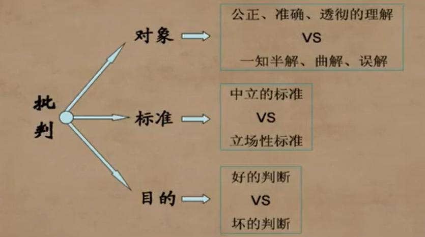

# 批判性思维：定义及价值

参考资料：[中国青年政治学院：批判性思维（谷振诣教授）](https://www.bilibili.com/video/BV1ex411Q7Li)

大学是职业学习者练习基本功的地方。比如语言基本功，思维基本功，做人的基本功，以及你所学专业的基本功。基本功练得有多扎实，将来自己发展的潜力就有多大。

## 第一讲 批判性思维定义

批评性思维是面对相信什么或做什么的决断而进行的言之有据的反省思维。

——Robert H. Ennis, 1992, Critical Thinking: What is It?

要理解定义需要明确两个重要概念：批判，反省思维

### 批判

批判的三个要素：对象，标准，目的

批判的基本原则：

1.  对象：宽容原则

    - 以合理性的最大限度理解所批判的对象【尽量避免误解、曲解或是一知半解等等】
    - 理解方面出现问题，这会严重影响批判的质量

2.  标准：批判的中立原则【立场性标准、中立标准】
    - 中立原则就是以无争议的或者绝大多数人认同的准则作为批判的标准。比如，逻辑准则、科学准则、法律准则、道德准则等等。
    - 使用立场性标准进行批判，容易产生争议，陷入公说公有理，婆说婆有理的境地。

宽容原则和中立原则是确保思维的客观性、公正性与合理性的原则。

批判的目标：得出好的判断（决断，决策）

1.  好判断的价值
    - 基于宽容原则和中立原则所得出的判断，要比以其他方式得出的判断，其质量要高得多。

> "世界上最稀有的东西，除了好的判断外，便是钻石和珠宝了。"
>
> ——布鲁叶（法）

### 反省思维（也可称为复盘式思维）

思维的几个层次：

1.  自然思维（如围棋-实战）

    自然的思考，洞察力和偏见，事实与错觉，真理与谬误......混合在一起的思考活动。

2.  反省思维（如围棋-复盘）

    对第一层思考的分析、评估、审验等反思性思考活动，对自己的所知进行校正、净化、更新、完善......

    批判是一种反思性的思维活动【------有思考就会有错误，所以铅笔的一端是笔铅，另一端是橡皮。------人贵有自知之明。】

在反思阶段，因为输赢已定，不受其影响。一种比较纯的反省思维模式。

### 自知之明

理解：

1.  知道自己知道什么，知道自己不知道什么；

2.  知道自己所知中的缺陷

获取：

苏格拉底：如何知道自己，他宣称除非过上一种自我省察的生活，否则没有人可以更多地了解自己。就是看清自己思想、信念、渴望和梦想背后的东西。

诘问式，批判的理性精神

苏格拉底的“诘问式”包含三种逻辑方法：

1.  他指出人们对道德名称定义的一些反例。
2.  他依据人们的道德信念做出逻辑推论。
3.  借助逻辑推论指明人有不一致的道德信念。

苏格拉底的盘问过程中还包含一种批判方式： **合作式批判**

> 合作式批判：以准确、透彻地理解批判对象为基础，以逻辑学的矛盾律为标准，以逻辑推论为手段，以帮助对方认知他所知中的缺陷为目标。

这就是苏格拉底创建的中立式批判方式，或称之为合作式批判方式。

精神助产术：他循循善诱，通过询问提出一些很漂亮的问题，按照对方的想法一步一步地使对方自己看清他思想背后的一些东西。

苏格拉底在被判处死刑之后，他的朋友克里同劝说他逃跑，而他没有同意，反而说了以下这番话：

> 我的本性从来都是，决不会听从任何朋友的建议，除非反思证明这是理性所能提供的最好方案。我不能单单因为目前的遭遇就放弃以往所采用的论证。

针对克里同的论证，苏格拉底提醒克里同注意以下两条原则：

1.  伤害他人（物）总是不对的。
2.  背弃对公义的承诺总是不对的。

_他解释说，当我决定住在雅典并在此抚养子女时，就已承诺接受城邦的所有裁决，逃跑违背了这个承诺。如果背弃了对城邦的承诺，就会对城邦造成伤害。所以，苏格拉底逃跑会触犯这两条原则。_

克里同的道德原则：

1.  勇士不能轻生；

2.  不该做敌人高兴的事情；

3.  不能抛弃抚养子女的责任。

苏格拉底的道德原则：

1.  伤害他人（物）总是不对的；

2.  背弃对公义的承诺总是不对的。

> 苏格拉底的道德信念：
>
> 道德上正当的行为遵从良善的理由。道德观念是对是错，道德行为是否正当，不取决于某种道德观念或行为本身，取决于支持这种观念或行为的理由。所以他坚信："未经省察的人生不值得过。"

苏格拉底的忧伤

苏格拉底的两份伟大的遗产：苏格拉底反诘法（或称苏格拉底方法）和批判的理性精神。

Wikipedia:

[Socratic method](https://en.wikipedia.org/wiki/Socratic_method)

[苏格拉底反诘法](https://zh.wikipedia.org/zh-cn/%E8%98%87%E6%A0%BC%E6%8B%89%E5%BA%95%E5%8F%8D%E8%A9%B0%E6%B3%95)

### 总结与回顾

批评性思维是面对相信什么或做什么的决断而进行的言之有据的反省思维。

- 基于宽容原则和中立原则

批判意味着理解与评判，而不是辩论或反驳。批判是建设性的思考方式，而不是破坏性的。

- 基于反省思维

批判重在自我批判。

> 批判性思维是自我指导、自我规范、自我检测和自我校正的思考。
>
> ——保罗（Richard W. Paul）

## 批判性思维的价值

> 应该把独立思考和综合判断能力放在首位，而不是获得特定知识的能力。
>
> ——爱因斯坦

重在理解能力、分析能力、判断能力，提高这个思维能力。

### 批判性思维的人生价值

思考三个问题：

- 你最相信谁？

- 你最听谁的？

- 谁能改变你？

这三个问题有相关性。

**相信自己** ：相信自己是什么意思？相信自己意味着每个人都按着自己所确信的“真理”而行动，然而，自己所确信的“真理”不就是真理，其中有真理，也有错觉、偏见、妄念、陈规陋习甚至迷信。我们所确信的“真理”是一个鱼龙混杂的信念系统，但它确实在支配着我们的行动。因而我们需要净化、校正、更新和优化我们的信念系统。

**自我改变** ：既然最听自己的，既然没人能改变你，那就只能寻求自我改变。批判性思维是寻求自我改变的工具。批判性思维的本质是审验和评估，净化、校正、更新、优化我们的信念系统，以便形成更好的选择和判断，并由此提高我们生活和工作的质量，成就卓越的人生。

哲学家怀特海：观念的变化牺牲最小，成就最大。【比如，邓小平“改革开放”的观念。】

斯宾塞·约翰逊：“会选择的人总是幸运的，不会选择的人只能自认倒霉。”

### 批判性思维的社会价值

> 批判性的思考习惯，如果它应用在社会中变得寻常的话，将遍及社会中所有的风俗，因为它是解决生活问题的方法。
>
> ——人类学和社会学的鼻祖，萨姆纳（W. G. Sumner），社会习俗，1906.
>
> 我们生活在信息和网络时代，这既是一个知识更新加速、信息爆炸的时代，也是信息泛滥、欺诈盛行、愿望和情绪化压倒理性和思考的时代。因而这是一个考验人的分辨力、判断力和创造力的时代，我们比以往任何一个时候都更需要批判性思维。------谷振诣

### 批判性思维的教育价值

> 只有对批判性思维能力进行教育培养，才能真正称得上是培养合格市民的教育。
>
> ——人类学和社会学的鼻祖，萨姆纳（W. G. Sumner），社会习俗，1906.
>
> 本科教育最重要的目的，是培养学生的批判性思维能力：熟练和公正地评估证据的质量，检测错误、虚假、篡改、伪装和偏见的能力......这对个人成功和国家需要都有核心的重要性。
>
> ——美国教育委员会 1972 调查报告（Lion. Gardiner, 1994）

## 总结与回顾

> 批判能力是教育和训练的产物。它是一种思维习惯和力量，是人们获得幸福的首要条件，是无论男女都应接受的训练。只有它才能保证我们不出现 *错觉、欺骗、迷信* 以及对自己和所处环境的 *误解* 。
>
> 萨姆纳（W. G. Sumner），社会习俗，1906

批判性思维是清楚错觉、识破欺骗、破除迷信、澄清误解、做出好的判断、迈向成功人生的工具；批判性思维是教育的使命；批判性思维是树立科学发展观，建设理性和民主社会的工具。

教材：

《批判性思维教程》谷振诣 刘壮虎，北京大学出版社，2006

参考书：

《批判性思维原理和方法》【加】董毓，高等教育出版社，2010

# 批判性思维：批判精神与理性美德

参考资料：[中国青年政治学院：批判性思维（谷振诣教授）](https://www.bilibili.com/video/BV1ex411Q7Li)

## 第二讲 批判精神与理性美德

好的批判性思考者应该具有批判精神和理性美德、具有好的思维品质和思维技能。

_**讨论：孔乙己是什么样的人？**_

（1）令人觉得搞笑【模糊】、悲剧的读书人；【空洞、不具体】【这个回答不是很精准】

（2）好吃懒做、很爱面子的人；【比（1）具体、很具体】

（3）受封建思想束缚很深的人；【玩大词、封建思想不好定义、根据感觉进行回答、具体受哪方面的封建思想怎么个束缚（这个不细）、】

（4）社会地位低【可以这么说】、诚实【诚实没有体现，每次喝酒都给钱讲信用不是诚实，诚信和诚实是有区别的】迂腐【迂腐也是有证据的】的人；

（5）善良的人、可怜的人、社会殉葬品；

（6）虚荣、怕人看不起、风趣；【和（2）类似】

---

（7）哀其不幸，怒其不争；【这是对孔乙己的评价】

（8）不知吸取教训，没心没肺的人；【回答问题的人或许有自己的想法，但是在与老师交流的过程中无法把自己真实的想法清晰准确地表达出来

（9）受封建礼教毒害和难以开化的人；

（10）受封建礼教毒害，有文人风骨。【（7）（9）（10）最不好，答非所问，问的是孔乙己是个什么样的人，而回答的是孔乙己成为这样人的原因。】

如果不知道孔乙己是个什么样的人，就用孔乙己成为这样人的原因来代替回答“孔乙己是个怎样的人”，这在逻辑上说不通？质询的不是回答的内容，质询的是你的思维方式有问题、回答问题的方式不对。

**_问题细化_** ：

1.  孔乙己有无真才实学？

要回答这个问题，我认为理解什么是“真才实学”非常重要。"真才实学（true skill and genuine knowledge）"：真正的才能和学识。后常用于形容人富有才能及学识。出自明·施耐庵《水浒全传》。

孔乙己没有真才实学。证据：

2, 孔乙己有无一技之长？

有。写得一手好字。

3, 孔乙己有什么嗜好？

喝酒。

4, 孔乙己挨过几次大？为什么挨打？

六次，四次直接描写：凡是出现“打”这个字的就是直接描写；两次间接描写："孔乙己脸上又填新疤痕了"。凡是写到打的地方都写到偷。因为偷挨打。

正是没有大知识的人才会在普通人面前卖弄知识：在小饭馆吃饭，跟饭馆伙计介绍“茴”字的四种写法。

**孔乙己：虚荣、懒惰【那时候的抄书相当于今天的复印店，抄书的工作量很大。因为有些线装书印完了不会重印，所以抄书的工作很重要。满可以够一个人混口饭吃，生活无忧。连丁举人都请他抄书，那说明这个人水平是不错的。有一个工作不好好干，一边抄书、一边顺手牵羊拿人家的东西换酒喝。】、嗜酒、偷窃。**

这种人的产生和封建礼教、封建制度没有关系。现在我们身边这种人很多。奴隶社会有这种人，封建社会有这种人，社会主义社会有这种人，资本社会也有这种人。

**鲁迅刻画的这个人是永恒的。** 刻画了人性的这种好吃懒做、虚荣，还有一身毛病。

即使是理解文学作品，你要把事实搞清楚。就是通过文字描述出来那样一个人物，你把他搞清楚了，然后我们再看看什么原因使得他变成这样了。对这种人怒其不争尚可，哀其不幸大可不必。这种人有什么可以值得同情的，什么社会能养得起这种人，什么公司现在敢雇这种人。

批判性阅读倡导独立思考和反思质疑的精神。反对人云亦云、盲目跟从、被动接收、死记硬背和机械模仿。反对一知半解、借题发挥、曲解原意、捕风捉影和夸大其词。

主张发挥思维的主动性，按照宽容原则忠实地进行聆听和阅读，对所听到的和读到的思想和观念、根据和理由，进行合理的反思和质疑。按照中立原则做出准确的评估和判断。

视频的某段引用中，余秋雨
前面说孔乙己极有学问，后面又说孔乙己掌握的都是残屑、灰烬，谷振诣认为这是自相矛盾的。

由此可以得出结论：

你坚持什么样的主张就是观点，不重要。重要的是\*给证据，给理由\*。理由要坚实，要成立。

### 批判精神

精神指的是人在思考问题时所体现出来的意志和追求。批判精神主要包括独立思考的精神、反思质疑的精神和开放兼容的精神。【主要的三种】

#### 独立思考的精神

- 独立思考：在寻找和发现问题、探究和解决问题，以及接受或拒绝一种思想观念时，充分发挥理性的自主。

- 批判性思维预设独立思考，或者说独立思考是批判性思维的最低要求。

相反，比如说依赖现成的答案，寻找模板、生搬硬套、死记硬背、人云亦云，甚至抄袭剽窃。这都是不独立思考的表现。

思考如果丧失了独立性，批判性就无从说起了。

- 在理解独立思考的时候，要注意：独立思考不是标新立异，独立于现存知识体系之外的“独立思考”是不存在的。

独立思考的实质不在于你提出什么样的观点，而在于你提出观点的过程是不是经过了严肃的探究和缜密的思考。是否充分发挥了理性的自主性。

#### 反思质疑的精神

- 反思是对思考的再思考，对自己的初始想法或看法进行推敲、审验、评估，找出其中的偏见、错觉、妄念甚至迷信等缺陷。

- 质疑是对观念的真理性和行动方案的合理性持有的疑问。"我相信......，是因为......；我这样做，是因为......。"理由是真的吗？潜在的假设可靠吗？推论合理吗？在没有充足理由和可靠推论的前提下，保持悬疑的态度、不下判断，既不轻易接受那个信念也不轻易地拒绝它，悬疑；直到找到充分的理由。

- 反思质疑是批判性思维的基本要求。【与它相反的做法是什么，迷信专家意见、轻信名人言论、盲目追捧流行思潮，墨守成规或者跟着感觉走，轻率武断等等，这些都是缺乏反思质疑精神的表现】

- 反思不是重复思考。如同借助镜子观察自己的面容一样，反思需要以换位思考所得到的看法为镜子，审查出自己所知中的缺陷。

想完成*换位思考*就意味着，你要对社会上的各种角色有深入的理解。换位思考越逼真越好，所以在进行换位思考时要把自己所有的东西都放掉，包括我是个男的等等。

要做到换位思考需要相当多的条件，需要不断地去努力训练。

- 质疑不是情感性的怀疑。【情感性的怀疑针对的是对方的动机，漠视对方的观点和论证，怀疑对方用心不良，却给不出任何证据，这都是不好的思维习惯。没把观点事实搞清楚，就去琢磨他为什么会这样，这已经形成了一种不好的思维方式了。要把它改过来、扭转过来】

#### 开放兼容的精神

- 开放就是拓宽视野、突破局限。

  自我中心（Egocentricity）与斯格托玛（Scotoma）：人们总是根据自己的经验、知识和已经形成的思维方式，来感知和判断眼前的事物，并认为\*我的感知和判断更好\*。心理学家将“\*我的更好\*”这样的方式成为自我中心。

自我中心人人都有。但自我中心会限制我们观察事物的角度，排斥不同的观念和思维方式，形成认知方面的盲点。心理学家把这种由于集中关注自我的认知而形成的盲点叫做\*斯格托玛\*（希腊文原意指黑暗，失去部分视野、盲点）。

"盲人摸象"的故事：摸到大象侧面的人，认定大象像一面墙；摸到大象大腿的人，认定大象像一根柱子；摸到大象耳朵的人，认定大象像一把大扇子......【这个故事表明了什么是自我中心和斯格托玛】

我们这个时代是一个知识爆炸和专业化的时代，那种百科全书式的人物不大可能再出了。那么专业化的时代实际上强化了自我中心的倾向。也就是说，专家的看法也存在斯格托玛。比如说，在分析一场战争的起因的时候，社会学家关注的是社会条件，经济学家关注的是经济条件，心理学家关注的可能是政治家那个人，他的动机和冲动。有意义的答案可能是这些不同的因素加上其他的一些社会因素的一个整合。

我们在看一些访谈节目，一些研究哪方面的专家，他就往往会过分强调他那方面的作用。

开放精神就是勇于突破自我中心的局限，破除斯格托玛的精神。亨特教授提出“三的规则”：

> 对问题至少要从三种角度去思考，提出三种方案来决定行动，考察三种反驳你的观点，寻找三个例子来解释一个概念，等等。
>
> Hunter, David A.2009. A Prantical Guide to Critical Thinking: What to Do and Believe.

因为我们天然有自我中心的倾向，所以我要人为努力的去遵循这三的规则呢去拓展视野，使你的盲点尽量少，我们不能做到绝对完美。

- 兼容就是减少分别心，对不同观点一视同仁。

  兼容优于宽容。宽容时一元价值观下的宽宏大量，宽容是有限度的【凡讲宽容的人，都是有底线的。讲宽容需要忍，他希望你在核心价值观那待着。一旦突破那个底线，绝不宽容】；兼容是多元价值观之下的海纳百川，没有限度【它承认各种观点，像大自然对待万物一样，它自身的那个价值不是以某一种核心价值观（如孟子只以自己儒家仁爱的思想为唯一的真理，凡是和它不符合的统统都不对）】。

任何一家之言【哲学流派】都是片面的深刻。不深刻不足以成一家之言，一深刻就免不了片面。因而我们要有兼容的胸怀。

> 景春说："公孙衍、张仪岂不诚大丈夫哉！一怒而诸侯惧，安居而天下息。"
>
> 孟子说："是焉得为大丈夫乎？子未学礼乎？......富贵不能淫，贫贱不能移，威武不能屈，此之谓大丈夫。"
>
> ——《孟子·滕文公下》
>
> "天地不仁，以万物为刍狗【刍狗：祭祀的时候草扎的狗；类同人死做的纸牛纸马】；圣人不仁，以百姓为刍狗。"
>
> ——《老子·5 章》

- 兼容指的是一种精神境界，不是不讲原则、没有立场。

即使我们想消灭一种业已存在的不良的那个思想观念，你也要先容下它，才能透彻地理解它，找出消灭它的办法。就像消灭计算机的病毒一样，你容不下它、不理解它，怎么能清除它。容纳它的存在，不是因为它应当存在，而是它已经存在。

- 开放兼容的精神是精通批判性思维的最高精神境界。

我的感受更深，我的欲求更迫切，我的看法更好，容不下对立的观点和反对意见，学阀作风严重，顺我者昌逆我者亡，这些都是缺乏开放兼容精神的表现。就像能吃的东西都有营养一样，面对百家之言，各有各的营养、各有各的局限，偏爱一家之言，就像偏爱一种食物一样会得理智上的营养不良症。开放兼容的精神是预防和治疗这种症状的良药。

## 总结与回顾

具有独立思考、反思质疑和开放兼容精神的人，才能成为好的批判性思考者。批判精神是克服懒惰和模仿、盲从和冲动、超越自我、精通批判性思维的前提条件。

精神在一种持久的追求中才得以显现出来，持久地追求独立思考、反思质疑和开放兼容的精神，需要有勇气和毅力，需要有勤奋、诚实、谦逊、执著、公正等理性的美德做保障。

## 理性美德

- 人脑的三种功能：

  （1）欲望【支配行为的第一动力】：理想、目标、愿望、动机、目的、价值等等。【欲望得到满足人就快乐，得不到满足人就痛苦。欲望决定了你是否在思考、决定了你的情感状态。】

  （2）情感【往往起到两方面的作用，一方面有它有利的一面，有激情，它就像一个发动机一样，推动着理性去、坚持不懈地去发挥它的聪明才智；它也有坏的一面，情感经常情绪化或者说急于求成，这样它就会使思维陷入那种快速劣质的状态，反而坏事，所以它是个双刃剑】：快乐、痛苦、喜悦、烦恼、平静、浮躁等等。

  （3）理性：分析、比较、概括、判断、推理、论证等等。

人的行为受三种要素支配，欲望是第一动力。

假如人完全按理智行事，那人就成了机器人了；

假如人完全按欲望行事，那人就成了野兽了；

假如人完全按情感行事，那人就成了疯子了。

遗憾的是人既不是机器人，也不是野兽，也不是疯子。欲望、理智、情感，这三种要素在每个人身上所发生的化学反应都不一样，它来推动人的行为。

**探究理性与欲望和情感的关系。** 在这个关系上谈理性的美德。就理性自身的这种特性去谈思维品质。

就理性与欲望和情感的关系而言，我们应当具有理性的谦逊、执著、公正、诚实、勇敢等理性美德。

就理性自身的特性而言，我们应当具有清晰性、相关性、一致性、准确性、严谨性、深刻性、充分性等等。包括辩证性，要具有这样的思维品质，以及辨别力、洞察力、判断力和创造力等思维能力。

讲解三种理性的美德：谦逊、执著、公正。

### 虚心与谦逊

> "虚心使人进步，骄傲使人落后。"

- 虚心意味着什么呢？虚心就是意识到自己的所知和信念是不完善的，具有倾听多方面意见、思考新问题、接纳新观念的态度和意愿。它意味着\*虚己容物\*和克服\*骄傲自满\*。

  - 虚己容物：在正常情况下，人们按照自己所认定的真理而行动，大脑的工作状态是高度自动化的。人的信念系统是自给自足的。当遇到富有挑战性的新问题和新观念的时候，这个系统的本能反应是排斥而不是容纳。当新观念与所认定的真理发生冲突的时候，不清除旧观念，新的观念就没有容身之地。

  - 满招损，谦受益。人们在成功的时候和自己所擅长的地方，容易骄傲、狂妄自大、自负。基于成功的经验和专长所形成的这个信念，往往会成为人的信念中的核心部分。对待自己的核心观念，人们像对待自己的宠物一样呵护它，然而在我们最宠爱的核心观念中也存在着错误的可能性，消除骄傲自满不容易。"关羽------骄傲失荆州。"

人经常跌倒在自己的优势上。所以在你成功的时候，在你优势擅长的地方，若能如履薄冰，才能有谦逊的美德。

- 虚心意味着放弃捍卫自己信念的态度，愿意倾听多方面的意见，留意来自各种渠道的事实和信息，关注各种可供选择的途径和方案，对新的思想观念持有一种好奇和主动追求的态度。

- 精神是人在思考时表现出来的意志和持久的追求。态度是人在思考时表现出来的当下的意愿和倾向。

虚心的态度 + 开放兼容精神 => 理性的谦逊

### 专心与执著

> "心欲安静，虑欲深远。心安静则神策生，虑深远则计谋成。"
>
> ——《鬼谷子·本经阴符七术》

- 专心与深思："欲多则心散，心散则志衰。"【专心致志意味着集中精力，一次思考解决一个问题。专心才有可能陷入深思，深思才有可能收获思考的成果】

- 执著与熟虑【深思不但要专心，而且要执著。有持之以恒的耐心，思考才能结出丰硕的果实来。越是棘手的问题，越有思考的价值。然而呢，越是棘手的问题，你在思考的时候遇到的困难和挫折就会越多，陷入深思时所遇到的疑惑也就会越多。这个时候要求你要执著、坚持住。】

> "只有人们心甘情愿地忍受疑难的困难，不辞劳苦地进行探究，他才可能有反省的思维。"
>
> ——杜威，我们怎样思维进行

- 贪欲导致浮躁，心急导致武断。【一次想思考的问题太多，弄的理智手忙脚乱，于是理智不得不疲于奔命，对这些问题作出粗糙地浅薄地处理，还有一方面就是急于求成，它不但要表现在做事中，同样表现在思考中。在没有对相关的事实和证据进行检视和评估以及没有对论证中的概念和推理进行深思熟虑的情况下，便匆忙地得出结论。下判断的时候胆大而轻率、任性而武断。】

专心和执著是治疗浮躁和武断的良药。

专心的态度 + 独立思考的精神 => 理性的执著

### 平和与公正 {#平和与公正}

> "人莫知其子之恶，莫知其苗之硕。"
>
> ——《大学》

- 公正的思考就是对自己的观念和他人的观点，或者相对立的观点一视同仁，尽量减少受自身利益和自我形象的影响。培养公正的思考离不开平和的心态。心态不平大多与\*自身利益\*或\*自我形象\*受损有关。

  - 自身利益：人们愿意相信给自己带来利益的观点或主张。我们应该认识到自身的利益未必都是正当合理的。即使是为维护自己正当合理的利益，你也没必要大喊大叫。心平气和容易使人看清楚问题的两面，更好地维护你自身的正当利益。所以说，不要把自己的名和利看得太重，你看得越重，你的情绪波动越大，你在思考问题的时候，受到的干扰就越大。反而不利于你去正当的维护你的利益。

    > "一个贪鄙的人推论起来，只要一边有钱，则另一边虽有很可靠的理由，你也会容易预见到那一边要占优势。"
    >
    > ——洛克，人类理解论

  - 自我形象：自己对自己的看法。我们喜欢把自己看成聪明、勤奋、诚实、负责任和讲道理的人。我们本能地具有维护自我形象的这个愿望和意志。当我的观点受到合理的质疑时，认错就是对自我形象的一种破坏。为了保住面子呢，第一种反应是想办法消灭那个反对意见，为自我形象解除威胁。而不是去看看那个意见和观点有没有道理。

    例子：

    > 如果一位学生的考试不及格，他会说："老师给了我一个不及格。"
    >
    > 如果他考了 90 分，他会说："我得了一个优秀。"

- 自私的思考态度引导我们为当前的信念和思考方式辩护，为谋求私利寻找理由，还会引起情感上的忐忑不安，理智上的强词夺理。

- 平和就是要有一颗平常心。不要过分看重自己的利益和形象，心就会静下来；心静下来，才能一碗水端平，公平地看待自己和他人的观点，将自身利益和自我形象的影响降到最小。

平和的心态 + 反思质疑的精神 => 理性的公正

## 总结与回顾

> "只是具有方法是知识，那是不够的；还必须具有运用方法的愿望和意志。"
>
> "如果勉强让我们选择，一个是个人的态度，另一个是关于逻辑推理的知识，也就是能巧妙处理问题的具体的逻辑方法，我将选择前者。"
>
> ——杜威，我们怎样思维，1933

杜威意思是这两者可以兼得。

**精神** 是人在思考时表现出来的意志和持久的追求。 **态度** 是人在思考时表现出来的当下的意愿和倾向。将当下的意愿和持久的追求结合起来，就会形成诸如理性的谦逊、执著、公正、勇敢、诚实、勤奋等好的 **理性美德。**

有关批判精神和理性的美德，可以阅读：

《思考的力量》【美】理查德·保罗 丁薇译，上海人民出版社，2005

《思考的艺术》【美】文森特·赖安·拉吉罗 马昕译，世界图书出版公司，2010

# 批判性思维：思维品质和思维技能

## 思维品质

理解力也是一种能力，它是理论和（实际操作意义上的）能力的结合。

思维的工具是概念、断言、推理和论证。清晰性是运用思维工具的入门性标准。任何一种学问都必须清楚，不然大家就无法读懂。因而在文科学科中追求清晰性就是一个艺术性的东西，它有程度差别，所以它更难。

### 清晰性

清晰性指的是思考问题时的条理和层次要清楚，运用概念和断言表达思想时，概念和断言的意义要清楚。事实问题、情感问题和价值问题，当面对一个事实问题进行思考的时候，任凭情感愿望的参与，以价值思考来左右自己的思维，这种现象很普遍。

### 相关性

相关性指的是围绕手中的问题进行思考，搜集与问题相关的信息，对问题做出有针对性的回答，避免将不相关的问题牵扯进来。在辩论过程中，问题的讨论往往经历这么个过程：事实问题 --> 价值问题 --> 情感问题。一开始都处于事实问题阶段，双方都是心平气和的，但是一会儿就会过渡到价值问题，这个时候争议就产生了。因为一旦牵扯到价值问题，就必然会有争议，为什么呢？因为每个人看问题的角度都不一样，你觉得这样做可行，他就会觉得无法忍受。争议就这样产生，然后升级，最后上升到情感问题。一旦处于这个阶段，就开始歇斯底里，没有最开始讨论问题的氛围了。处于这个阶段的双方，会认为与自己持相反观点的人一定是有问题的，对方的观点一定是错误的。最后可能会上升到人身攻击的恶劣层次。

### 一致性

在清晰和相关的前提下，存在一致或不一致的问题。不一致的思想是荒谬的，不一致的问题是没法回答的，不一致的行为是有害的。

### 总结与回顾

就理性自身的特性而言，清晰、相关、一致是思考的最低要求，就如同正直、诚实、勤劳是做人的最低要求一样。此外，诸如准确、严谨、深刻、充足、辩证等理性的要求，都是衡量思考质量的标准。

在日常的思维活动中，将这些理性的要求内化为思维的品质，形成良好的思维习惯，这是批判性思维习惯教育的重要任务。因为理性是人的根本特性之一。

## 思维技能

面对相信什么或做什么，我们会产生一些想法或主张，当我们考量一个主张好不好时，就是在进行批判性思维。判定一个主张的好坏，是对思考的再思考，也就是反思。

给出支持主张的理由叫论证。对论证好坏的评估，其核心就是对理由和推理质量的评估。

尽管专家们对批判性思维技能有不同的看法，绝大多数专家都认同：评估论证好坏的能力是批判性思维核心的思维技能。

1.  评估论证好坏的核心标准

    （1）理由真实

    （2）推理符合逻辑规则

2.  评估论证的任务和技能

    围绕论证的三个要素，提出批判性问题：

    （1）议题和主张

    （2）理由和假设

    （3）推理

要想评估论证的好坏，展开这个工作，有两部分，第一是考验人的理解力，面对一个论证要透彻地理解它，第二方面才使用中立的标准，去评估它的好坏。

在理解一个论证时，我们要完成这些任务：

- **中心议题是什么？**

- 在中心议题上的 **主张** 或 **结论** 是什么？

- 支持主张的 **断言** 或 **理由** 是什么？

---

- 对议题、主张、理由以及论证语境的表达是否 **清晰？**

- 理由 **真实** 吗？若真实，与主张 **相关** 吗？

- 推论是建立在某种 **假设** 上吗？若是，假设 **合理** 吗？

- 从理由得出结论的 **推理** ， **符合逻辑规则** 吗？

- 结论是否 **超出** 了理由担保的 **限度** ？

- 是否存在 **削弱** 结论的其他证据？

以上九个思维任务的总结：

### 总结与回顾

训练批判性思维不仅要有批判精神和好的思维品质，还要有熟练运用批判性思维方法的技能。训练思维技能，如同训练弹琴和开车等其它技能一样，掌握正确的方法，再加上勤奋苦练。

### 推荐书目

《思考的力量》【美】理查德·保罗 丁薇译，上海人民出版社，2006

《批判性思维原理和方法》【加】董毓，高等教育出版社，2010

# 批判性思维：批判性阅读的方法和实践

> 大学生是职业的学习者，阅读是职业学习者的一项重要工作，批判性阅读是职业学习者必备的一项职业技术。

**如何阅读论证性的文章** 是批判性阅读最重要的任务。

## 批判性阅读的方法和技术

### 批判性阅读的阶段、目的和任务

- **阶段 1：理解阶段**

  - 目的：理解

  - 立场：和作者对话

  - 任务：发掘论证

- **阶段 2：批判阶段**

  - 目的：评估

  - 立场：自主思考

  - 任务：拷问论证

### 理解方法：宽容原则/发掘论证

- 理解性问题

  - 了解作者、出版和背景信息

  - 文章的中心议题是什么？

  - 作者的主张或结论是什么？

  - 支持结论的理由或前提是什么？

  - 关键性概念或词语的含义是什么？

  - 论证的基本要点是什么？

  - 分析论证结构，由前提到结论的推理是什么？

在理解这个阶段，除了我们要站在作者的立场上跟他互动，坚持宽容原则之外。不要事先把自己的一些成见、偏见等等这些想法代入到理解中，要尽量避免这个。这样我们能够尽量做到客观公正地去理解作者那篇文章。

### 批判方法：中立原则/拷问论证

- 批判性问题

  - 理由是真的吗？

  - 理由与结论相关吗？

  - 若相关，推理合乎逻辑吗？

  - 从理由得出结论，需要依靠某种假设【"假设"指在论证中未表达的前提】吗？

  - 这种假设合理吗？

  - 是否存在与结论相关的反例？

  - 需要限定或解释论证中的某些概念或词语吗？

## 案例分析：北京污染的影响？不清除

分析论证的结构：树状图解（I 型、T 型、V 型）

## 拷问论证

- 理由是真的吗？

  确认数据/事实。

- 从理由得出结论需要某种假设吗？

- 这些假设合理吗？

  这两个假设都有不符合逻辑的地方。

- 推理合乎逻辑吗？

  因果推论里存在偷换概念的问题。

- 是否存在与结论相关的反例？

- 需要限定或解释论证中的某些词语（概念）吗？

  从公正客观的角度讲是需要的，不要使用带有强烈主观感情色彩的词语。

  使用情感色彩的词汇，一般都表明了作者形成了倾向性。

## 图尔明（Stephen E. Toulmin）模型

### 一个好论证，由六个部分组成

- 数据（Data）：事实、证据（相当于小前提）

- 断言（Claim）：被证明的结论、主张、观点。

- 保证（Warrant）：用来连接证据和结论之间的普遍性原则、规律（相当于大前提）【而大前提是可能被省略的，当被省略时，我们称此时的大前提为“隐含的假设”】。

- 支撑（Backing）：为保证（大前提）提供进一步支撑的陈述、理由，以表明原则或规律是真的。

- 辩驳（Rebuttals）：对已知反例的考虑。

- 限定（Qualifiers）：考虑到可能出现的反例，对结论的范围和强度进行限定。

图尔明提供的论证模型更接近真实的论证。

### 图尔明模型的特点和优点

- 把起不同作用的理由以不同的位置标识出来

- 明确了保证自身也需要证明

- 突出了辩驳和限定成分的重要性

- 图尔明模型会更接近实际论证的模式

## 总结和回顾

批判性阅读就是要在坚持宽容原则基础上，准确地回答理解性问题；在坚持中立原则的基础上，恰当地回答评估性问题。在准确地理解和恰当的评估基础上，得出论证好坏的判断。

分析论证的结构是批判性阅读最具有挑战性的任务，图尔明模型为完成这项任务提供了帮助，而且为构造好论证提供了指引。

理解图尔明模型、批判性阅读方法了解：

The Use of Argument Toulmin, Stephen E. 2003, Cambridge University Press.

批判性思维的原理和方法，第 3 章，【加】董毓，2010，高等教育出版社
